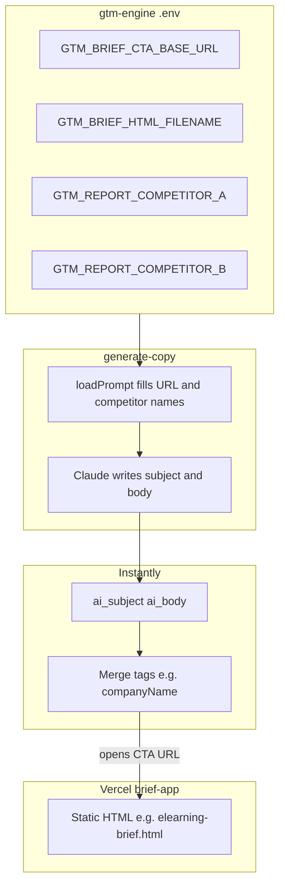

# Vertical HTML briefs, email copy, and Instantly

This guide explains how **industry-specific static briefs** on Vercel, **Claude-generated copy**, and **Instantly** fit together — and what you must configure so they stay aligned.

---

## The idea in one picture



You choose `GTM_REPORT_COMPETITOR_*` by reading the same HTML you deploy (titles / H1), so the email and the page stay in sync.

1. You host a **fixed** HTML brief per vertical (e.g. Docebo vs Absorb for e-learning).
2. You set **env vars** so the **email** names the **same two competitors** and points to **that file** on your domain.
3. You generate **copy JSON**, then push to Instantly. The **body** still contains **`{{companyName}}`** as text for Instantly to merge per lead.

---

## Environment variables (gtm-engine/.env)

Set these **together** for each vertical campaign before `npm run generate-copy`:

| Variable | Purpose | Example |
|----------|---------|---------|
| `GTM_BRIEF_CTA_BASE_URL` | Production host (no trailing slash). Replaces `https://yourdomain.com` in the prompt. | `https://intel.nextbuildtech.com` |
| `GTM_BRIEF_HTML_FILENAME` | Which static file under `brief-app/public/`. Replaces `__BRIEF_HTML_FILENAME__` in the prompt. | `elearning-brief.html` |
| `GTM_REPORT_COMPETITOR_A` | First competitor **exactly as in the HTML brief** (headings, title). | `Docebo` |
| `GTM_REPORT_COMPETITOR_B` | Second competitor **exactly as in the HTML brief**. | `Absorb LMS` |

**Locking rule:** If **both** `GTM_REPORT_COMPETITOR_A` and `GTM_REPORT_COMPETITOR_B` are set, the prompt tells Claude **REPORT-LOCKED** — it must use only those names in the baseline sentence and anywhere it names that pair.

If **either** is missing, the prompt uses **NO LOCK** — Claude infers two competitors per lead (older behavior). Good for generic batches; **bad** if the CTA still points at a brief about a specific pair.

**Another vertical (e.g. management consulting):**

1. Add `brief-app/public/management-consulting-brief.html` and deploy brief-app.
2. Change `.env`: new filename + new competitor names matching **that** HTML.
3. Run `generate-copy` on a lead file filtered to that industry (e.g. `--file data/processed-...-batch.json`).

---

## Commands (typical e-learning batch)

```bash
cd gtm-engine

# 1) Set .env (host, HTML file, competitors matching elearning-brief.html)

# 2) Dry sanity — optional
npm run generate-copy -- --first 1 --file data/processed-companyindustry-e-learning-equals-batch.json

# 3) Full run
npm run generate-copy -- --file data/processed-companyindustry-e-learning-equals-batch.json
```

Output: `data/copy-<timestamp>.json`. The `meta` block records `briefHtmlFilename`, `reportCompetitorA` / `B`, and `reportCompetitorsLocked` so you can audit what was assumed for that file.

---

## Instantly: merge tags and `{{companyName}}`

- The generated **body** must keep the literal substring **`{{companyName}}`** in the URL (Claude is instructed to do this).
- In Instantly, define a **custom variable** (or lead field) named **`companyName`** (same spelling) and map it from each lead — e.g. a slug you also use for brief open tracking (`?id=`).
- Your sequence should use the **same** merge syntax Instantly expects (often `{{companyName}}` or `{{custom.companyName}}` depending on setup). **If the spelling differs**, either change Instantly or post-process the copy file before upload.

`4-push-instantly.js` sends `ai_subject`, `ai_body`, and `title` as custom variables; the **email template** in Instantly must reference those variables so the stored body (with `{{companyName}}`) is merged at send time.

---

## Will it all work flawlessly?

**Not automatically.** It works reliably when you:

| Check | Why it matters |
|-------|----------------|
| Env matches the deployed HTML | Wrong competitor names → email disagrees with the page. |
| Brief file exists on Vercel | Wrong `GTM_BRIEF_HTML_FILENAME` → 404 or wrong vertical. |
| `{{companyName}}` survives Claude | Rarely the model breaks the token; spot-check copy JSON. |
| Instantly merge name matches | Mismatch → literal `{{companyName}}` in inbox or wrong id in URL. |
| Lead id matches your tracking convention | `?id=` should match what **brief-app** / Slack logging expect (normalized lead key). |

So: **the pipeline is sound**, but **you** are responsible for **per-campaign** env alignment, **one batch per vertical per run** (or change `.env` between runs), and **QA** on a few rows before full push.

---

## Related files

- Prompt template: [`prompts/personalization.txt`](../prompts/personalization.txt)
- Substitution + logging: [`scripts/3-generate-copy.js`](../scripts/3-generate-copy.js)
- Example brief: [`../../brief-app/public/elearning-brief.html`](../../brief-app/public/elearning-brief.html)
- Push to Instantly: [`scripts/4-push-instantly.js`](../scripts/4-push-instantly.js)
